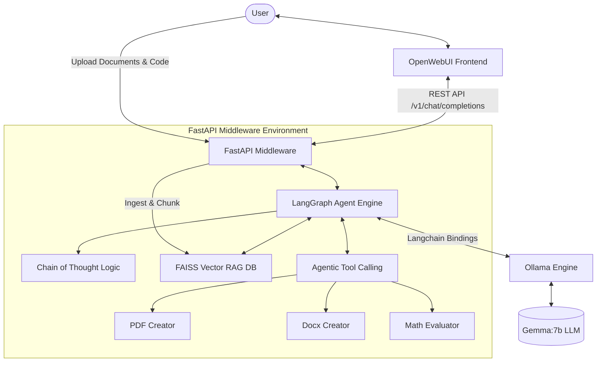

# Mossy Chatbot

**Version**: 1.0.0  
**Date**: April 7, 2026  
**Author**: Glenn Mossy, AI and Machine Learning Engineer  

---

## 🌟 Executive Summary
Mossy Chatbot is a truly state-of-the-art Agentic Chat application built to operate 100% locally and securely. It bridges the breathtaking aesthetics of the ChatGPT-clone **OpenWebUI** with a highly sophisticated **LangGraph** Python architecture. 

It handles advanced mathematical calculations, dynamic multimodal generation (PDF/Word), and real-time knowledge synthesis through an integrated **FAISS Vector RAG Engine**—all powered locally via **Google's Gemma** Large Language Model.

---

## 🧩 Architectural Diagram

The system employs a cyclical graph-based multi-agent architecture utilizing Chain of Thought (CoT) loops prior to yielding stream responses to the frontend.



---

## 🗂️ Repository Structure

```text
mossychatbot/
│
├── docker-compose.yml              # Core container deployment manifest
├── init-ollama.sh                  # Shell script for automated model fetching
├── README.md                       # Architectural Documentation
│
└── middleware/                     # The Python Agent Layer
    ├── Dockerfile                  # Container compilation instructions for UV and 3.13
    ├── requirements.txt            # Explicit dependency pinning
    │
    └── app/
        ├── main.py                 # FastAPI Application Factory & Routing
        │
        ├── api/
        │   └── routers/
        │       ├── chat.py         # OpenAI-compatible streaming completion route
        │       └── documents.py    # Custom RAG ingestion endpoints
        │
        ├── core/
        │   └── config.py           # Dave Ebbelaar style pydantic configurations
        │
        ├── models/
        │   └── schemas.py          # Unified DTO & payload serialization schemas
        │
        └── services/
            ├── agent_service.py    # LangGraph StateGraph engine with CoT constraints
            ├── llm_service.py      # Bridging layer for stream conversions
            ├── rag_service.py      # Internal FAISS indexing, ingestion, and search
            └── tools.py            # Custom math, pdf, and word generation logic
```

---

## 🛠️ Installation & Setup Prerequisites

To utilize the full capabilities of the Mossy Chatbot, ensure you are running on an Apple Silicon Mac (M-Series) with a minimum of 16GB Unified RAM (48GB recommended for larger vision models), and have Docker Desktop installed.

### 1. Clone the Repository
Open a terminal and clone the repository directly from GitHub:
```bash
git clone https://github.com/gmossy/mossychatbot.git
cd mossychatbot
```

### 2. (Optional) Run the Local Python Environment Directly
If you wish to test the API decoupled from Docker, use `uv` for blazing-fast 3.13 compilation:
```bash
# Enter the middleware domain
cd middleware

# Establish the exact Python 3.13 environment seamlessly via UV
curl -LsSf https://astral.sh/uv/install.sh | sh
source $HOME/.local/bin/env
uv venv --python 3.13 .venv

# Activate and Install Requirements instantaneously
source .venv/bin/activate
uv pip install -r requirements.txt

# Start the Fast API 
uvicorn app.main:app --host 0.0.0.0 --port 8000
```

### 3. Deploy Production Stack via Docker
The simplest way to use OpenWebUI is to spool up the entire integrated ecosystem via our customized docker orchestration.

```bash
cd mossychatbot

# Initialize the containers in detached mode
docker compose up -d --build
```

---

## 📡 Usage Details

- **Frontend Interface:** [http://localhost:3000](http://localhost:3000)
- **API Swagger Documentation:** [http://localhost:8000/docs](http://localhost:8000/docs)
- **ReDoc Visualization:** [http://localhost:8000/redoc](http://localhost:8000/redoc)

### Testing RAG Features
Simply drag and drop PDFs, `.docx` files, or Python scripts into the chatbox in OpenWebUI. Alternatively, hit the custom ingestion endpoint directly via shell:
```bash
curl -X POST -F "file=@your_research_paper.pdf" http://localhost:8000/v1/upload
```

### Extending Vision Capabilities (Images)
If you wish for the UI to be capable of extracting contextual relevance from literal images via open source sight recognition, simply open your host terminal and download Llava natively:
```bash
ollama run llava
```
It will automatically map right back into your chat environment!
