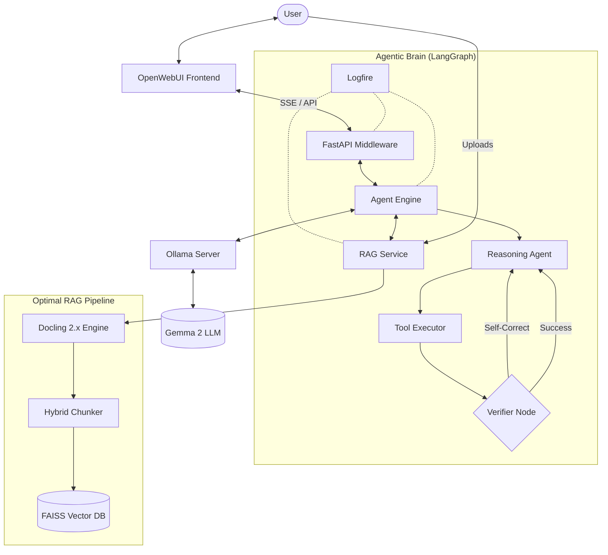

# 🤖 Agent Chatbot (V2)
**Autonomous Knowledge Engine with MCP, Obsidian, & Docling**

**Tech Stack**: Python 3.12+, LangGraph, Docling 2.x, MCP (Model Context Protocol), FAISS, Ollama

---

## 🌟 Executive Summary
This project is a **distributed agentic knowledge engine**. It uses a **LangGraph** orchestration layer across local files (Docling), Obsidian vaults (Live Sync), and external databases (via MCP).

The system features an **"Index of Indexes"** architecture—allowing the agent to autonomously discover, switch between, and reason across multiple specialized knowledge bases based on the user's intent.

---

## 🧩 Architectural Diagram

The system employs a multi-agent **Evaluator-Optimizer** loop, capable of dynamically calling local tools or remote MCP servers (ArangoDB, OpenSearch).



## 🚀 Quick Start (Clone & Run)

### 1. Clone the Repository
```bash
git clone https://github.com/<your-org>/<your-repo>.git
cd <your-repo>
```

### 2. Configure the Environment
Create a `.env` file in the root directory. You can copy the template:
```bash
cp middleware/.env.example .env
```

**Required Parameters:**
- `HF_TOKEN`: Your HuggingFace Token (required for embedding models).
- `LOGFIRE_TOKEN`: (Optional) Your Logfire project token for distributed tracing.
- `OLLAMA_BASE_URL`: Defaults to `http://ollama:11434` for Docker, or `http://localhost:11434` for local dev.

### 3. Build & Run (Docker)
The project is fully orchestrated via a centralized `Makefile`:

```bash
# Build the images (no-cache to ensure latest Docling/dependencies)
make build

# Start the full stack (OpenWebUI + Middleware + Ollama)
make up

# Watch the logs
make logs
```

---

## 🔧 Environment & Observability (Logfire)

This project uses **Logfire** for deep observability and distributed tracing across the agentic loop.

- **To enable Logfire**: Set `LOGFIRE_TOKEN` in your `.env`.
- **To change the project name**: Update `LOGFIRE_PROJECT_NAME`.
- **Legacy Formats**: The RAG pipeline automatically detects legacy binary formats (`.doc`, `.xls`) and logs a warning with a "How to fix" hint in Logfire while providing a clear error message to the user.

---

## 🧠 Changing LLM Models

The chatbot defaults to **Gemma 2**. You can swap models easily:

1. **Via UI**: In OpenWebUI, select the model from the dropdown. If a model isn't downloaded, the middleware will attempt to pull it automatically.
2. **Via Docker Compose**: Update the `DEFAULT_MODELS` environment variable in `docker-compose.yml`.
3. **Optimizing for Mac**: For 100% performance on Mac M-Series, run Ollama natively (`OLLAMA_HOST=0.0.0.0 ollama serve`) and update `OLLAMA_BASE_URL` in `.env` to `http://host.docker.internal:11434`.

### 🔐 OpenWebUI Authentication & Passwords

**Initial Setup (First Launch):**
1.  Navigate to [http://localhost:3000](http://localhost:3000).
2.  Click **Sign Up**.
3.  **The first user account created automatically becomes the Administrator**.
4.  No default passwords are pre-set; you define your own during the initial registration.

---

## 🏗️ The RAG Pipeline (Docling Enhancements)

The `RAGService` has been modernised with **Docling 2.x**:
- **Structured Parsing**: Uses `DOC_CHUNKS` and `HybridChunker` (layout-aware) to ensure tables and semantic structures are preserved.
- **Multi-Format Support**:
    - **Native**: PDF (with OCR), DOCX, XLSX, PPTX, HTML, XML, CSV.
    - **Source Code**: Python, C++, C, CUE, Go, Rust, Java, etc.
    - **Images**: Native OCR via Docling IMAGE pipeline with Tesseract fallback.
- **Bulk Ingestion**: Supports automated ingestion of entire directories via `rag.bulk_ingest("/path/to/docs")` with graceful error skipping.

---

## 📡 Usage Commands

| Command | Action |
|:---|:---|
| `make up` | Start full docker stack |
| `make build` | Rebuild middleware with latest dependencies |
| `make run` | Run middleware locally for debugging |
| `make test` | Run diagnostic suite (RAG Stress, OCR, Dispatch) |
| `make clean` | Stop containers and clear all persistence volumes |

---

## 🧪 Testing
We maintain a robust suite of tests in `middleware/tests/`:
- `test_rag_dispatch.py`: Verifies optimal routing for all 15+ supported file formats.
- `test_pdf_quality.py`: Validates high-fidelity extraction from complex PDFs.
- `test_vision_ocr.py`: Ensures Tesseract fallback is functional for pure image files.
